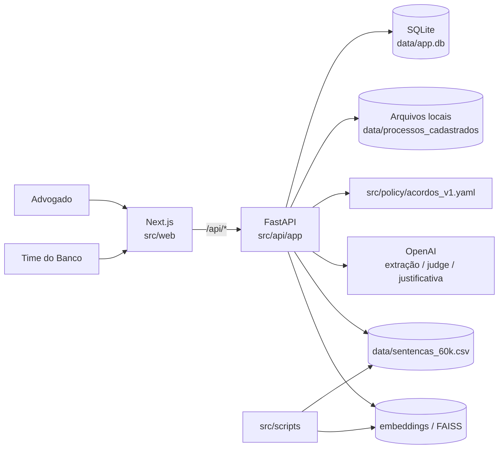
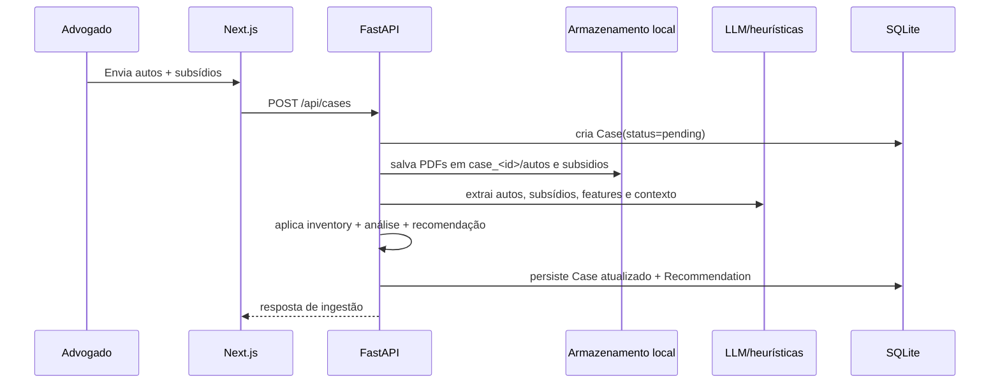

# Arquitetura

## Objetivo

Este documento descreve a arquitetura atual do MVP, com foco no que já existe no repositório e no runtime Docker. O objetivo é explicar como os módulos se relacionam, como os dados circulam e onde estão os principais pontos de evolução.

## Visão Geral

O sistema é dividido em quatro blocos principais:

- `src/web/`: interface web do advogado e dashboard do banco em Next.js
- `src/api/`: backend FastAPI com ingestão, análise, recomendação, outcomes e analytics
- `src/policy/`: artefatos versionados da política e materiais correlatos
- `src/scripts/`: utilitários offline para análise histórica, embeddings e saneamento

No runtime atual, a stack sobe dois serviços:

- `web`: Next.js servindo UI e fazendo proxy das rotas `/api/*`
- `api`: FastAPI servindo endpoints REST, persistência SQLite e processamento de casos

## Topologia



## Estrutura Física

```text
src/
├── api/
│   └── app/
│       ├── analytics/
│       ├── core/
│       ├── llm/
│       ├── models/
│       ├── routers/
│       ├── schemas/
│       └── services/
├── web/
│   ├── app/
│   ├── components/
│   └── lib/
├── policy/
└── scripts/

data/
├── app.db
├── processos_cadastrados/
├── processos_exemplo/
└── sentencas_60k.csv

docs/
├── architecture.md
├── demo_video.mp4
├── guides/
└── slides/
```

## Runtime e Deploy

### Desenvolvimento

`compose.yaml` sobe:

- `api` a partir de `src/api/Dockerfile`
- `web` a partir de `src/web/Dockerfile`

Mounts mais relevantes:

- `./src/api:/app`
- `./src/web:/app`
- `./data:/workspace/data`
- `./src/policy:/workspace/src/policy`
- `./arquivos_adicionais:/workspace/arquivos_adicionais:ro`

Variáveis críticas:

- `DATABASE_URL`
- `CASE_STORAGE_DIR`
- `POLICY_PATH`
- `OPENAI_API_KEY`
- `API_INTERNAL_URL`

### Produção

`compose.prod.yaml` mantém a mesma separação entre `web` e `api`, removendo apenas detalhes de hot reload e bind mounts do frontend.

## Backend

### Ponto de entrada

O app FastAPI nasce em `src/api/app/main.py`. No lifespan, ele:

- cria tabelas SQLAlchemy
- garante o schema SQLite complementar
- registra os routers de health, cases, recommendations, outcomes e dashboard

### Camadas

#### `routers/`

Responsáveis por contrato HTTP e orquestração:

- `cases.py`: upload, listagem, detalhe e leitura de PDFs
- `recommendations.py`: materialização e retorno da recomendação
- `outcomes.py`: registro da decisão final do advogado
- `dashboard.py`: KPIs e agregações analíticas
- `health.py`: healthcheck

#### `services/`

Responsáveis pela lógica de domínio:

- `extractor.py`: leitura de PDFs, extração estruturada e montagem do payload analítico
- `document_inventory.py`: inventário documental determinístico
- `agreement_policy_v5.py`: núcleo estatístico/jurídico da V5
- `decision_engine.py`: transforma snapshot do caso em recomendação V5
- `recommendation_pipeline.py`: aplica judge, justificativa e sincroniza status
- `judge.py`: revisão factual da recomendação
- `justifier.py`: geração de justificativa textual
- `case_maintenance.py`: normalização e diretório canônico do caso
- `policy.py`: leitura do arquivo de política

#### `models/` e `schemas/`

Separação entre persistência e contrato de API:

- `Case`
- `Recommendation`
- `Outcome`

#### `analytics/`

Camada de apoio estatístico e semântico:

- leitura do histórico
- recuperação de metadata de embeddings
- geração de texto semântico de runtime

## Frontend

### Organização

O frontend usa App Router e está dividido em:

- `app/`: páginas
- `components/`: blocos de UI e widgets
- `lib/`: cliente API, tipos e utilitários

### Superfícies principais

- `/inbox`: fila de casos para o advogado
- `/caso/[id]`: leitura do caso, documentos, recomendação e outcome
- `/dashboard`: visão do banco com KPIs e gráficos

### Acesso ao backend

`src/web/lib/api.ts` centraliza a chamada dos endpoints. No server-side do Next, as rotas usam `API_INTERNAL_URL`; no browser, a UI usa o próprio path `/api/*`.

## Fluxos Principais

### 1. Ingestão de caso



Passos internos relevantes:

1. persistência dos PDFs em `data/processos_cadastrados/case_<id>/`
2. leitura textual com `pdfplumber`
3. extração estruturada
4. cálculo de inventário documental
5. geração da recomendação inicial

### 2. Consulta de recomendação

Quando a UI pede `GET /api/cases/{id}/recommendation`, o backend:

1. lê o caso
2. monta o snapshot normalizado
3. recalcula o payload V5
4. decide se precisa refazer `judge` e `justificativa`
5. persiste/atualiza a última recomendação
6. sincroniza o status do caso

Isso mantém a recomendação consistente com o estado mais recente do caso, sem depender de uma etapa manual separada.

### 3. Registro de outcome

No `POST /api/cases/{id}/outcome`, o backend:

1. localiza o caso e a recomendação vigente
2. registra a decisão do advogado
3. marca se houve aderência à recomendação
4. persiste valores negociados ou condenação
5. fecha o status do caso como `decided` ou `closed`

### 4. Dashboard analítico

O dashboard do banco consome:

- `/api/dashboard/metrics`
- `/api/dashboard/analytics?uf=&sub_assunto=`

As agregações são calculadas em memória a partir de `Case`, `Recommendation` e `Outcome`, produzindo:

- KPIs operacionais
- Pareto por subassunto
- relação valor pedido x valor pago
- distribuição de resultado macro e micro
- matriz de taxa de sucesso por quantidade de documentos e UF

## Persistência

### Banco

O backend usa SQLite no MVP:

- arquivo principal: `data/app.db`
- tabelas: `cases`, `recommendations`, `outcomes`

### Documentos

Os PDFs enviados ficam em armazenamento local:

```text
data/processos_cadastrados/case_<uuid>/
├── autos/
└── subsidios/
```

Esse caminho também é refletido em `case.source_folder`.

### Histórico e embeddings

Artefatos offline:

- `data/sentencas_60k.csv`
- `data/embeddings.npy`
- `data/embeddings.faiss`
- `data/embeddings_metadata.json`

Eles não fazem parte do hot path principal da recomendação V5, mas suportam analytics e rotinas auxiliares.

## Política e Decisão

### Princípio arquitetural

O núcleo da decisão fica concentrado na V5, com comportamento determinístico e auditável. O LLM fica nas bordas:

- extração estruturada
- revisão factual (`judge`)
- justificativa textual

### Benefícios dessa separação

- menor variabilidade no hot path decisório
- rastreabilidade por `policy_trace`
- possibilidade de revisão jurídica da política sem reescrever toda a aplicação
- menor acoplamento entre UI, decisão e explicação textual

## Scripts Offline

`src/scripts/` concentra rotinas fora do ciclo online:

- `analyze_historical.py`: leitura e EDA do histórico
- `build_embeddings.py`: geração de embeddings e índice FAISS
- `eval_policy.py`: backtest econômico da V5
- `sanitize_cases.py`: reparo/saneamento de casos legados

Esses scripts compartilham a base de código do backend, mas não são chamados no fluxo transacional da UI.

## Decisões Arquiteturais

### 1. Web e API separados

Permite evoluir interface e backend em ritmos diferentes, mantendo o frontend como cliente explícito dos contratos REST.

### 2. Política fora de `services/`

Os artefatos da política vivem em `src/policy/`, o que ajuda a separar:

- código de execução
- material normativo/oráculo
- insumos de negócio

### 3. Armazenamento local no MVP

Mais simples para hackathon e demo local. O ponto de substituição natural é um storage S3-compatible, mantendo o `source_folder` como abstração mínima de localização.

### 4. Dashboard derivado do banco transacional

Hoje simplifica a implementação. No futuro, o caminho natural é extrair uma camada analítica própria ou materializações incrementais.

## Limitações Atuais

- OCR para PDFs escaneados ainda não é um fluxo robusto do MVP
- SQLite atende ao MVP, mas não à concorrência de produção
- analytics ainda são calculados sob demanda
- parte da documentação do repositório ainda está em `docs/guides/` e funciona como material de apoio, não como fonte única consolidada

## Evolução Recomendada

Curto prazo:

- consolidar a documentação em torno deste arquivo
- adicionar `docs/policy_rationale.md`
- formalizar fluxos assíncronos de processamento, se o volume de PDFs crescer

Médio prazo:

- trocar SQLite por Postgres
- extrair storage de documentos para objeto externo
- separar analytics em jobs/materializações
- adicionar autenticação e trilha de auditoria por usuário

## Referências

- visão de produto: `README.md`
- setup operacional: `SETUP.md`
- guia detalhado: `docs/guides/PROJECT_SKELETON.md`
- execução Docker: `docs/guides/DOCKER.md`
- planejamento: `docs/guides/TEAM.md`
